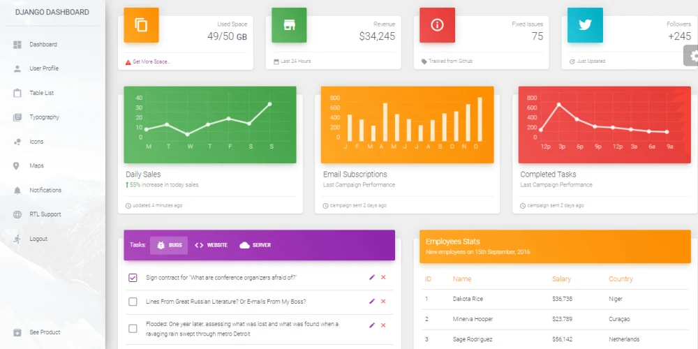
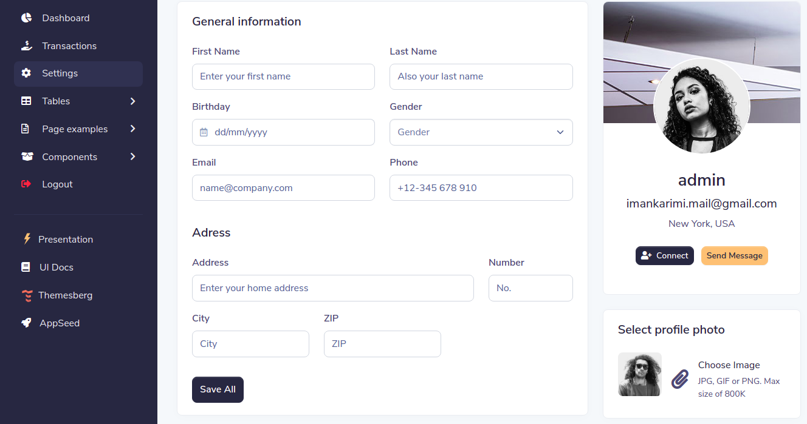

<!DOCTYPE html>
<html>
<head>
	<title>Django-WebApp</title>
</head>
<body>
	<h1>Django-WebApp</h1>
	
This project was done for an internship at Qurinom Solutions.

	<h2>Overview</h2>
	
The use of this project is to transfer data files and announcements with the company systems connected to the servers. The features of this project are that the company user can register and login into the web application only with his company webmail id. The employees can share the data with all the other employees with this application, and the uploaded file can be edited at any time.

	
Also, the employees can search and view profiles of other users. They can share their uploaded files with any of those users.The additional feature is where the employees can set their profile pictures. But in default, the profile pictures added are apple face emojis.The type of files, such as images, videos, text files and different kinds of programs like python code,java code etc., can also be uploaded.

	<h2>Technologies Used</h2>
	<ul>
		<li>Python</li>
		<li>Bootstrap</li>
		<li>Django</li>
		<li>JavaScript</li>
	</ul>
	<h2>Screenshots</h2>
	<h3>Login Page</h3>
	
	<h3>Dashboard</h3>
	
	<h3>Profile Page</h3>
	
	<h3>Upload Files</h3>
	
</body>
</html>
